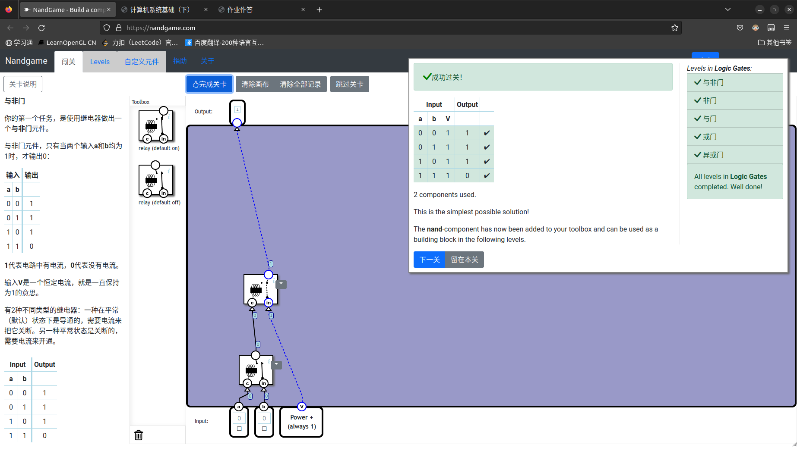
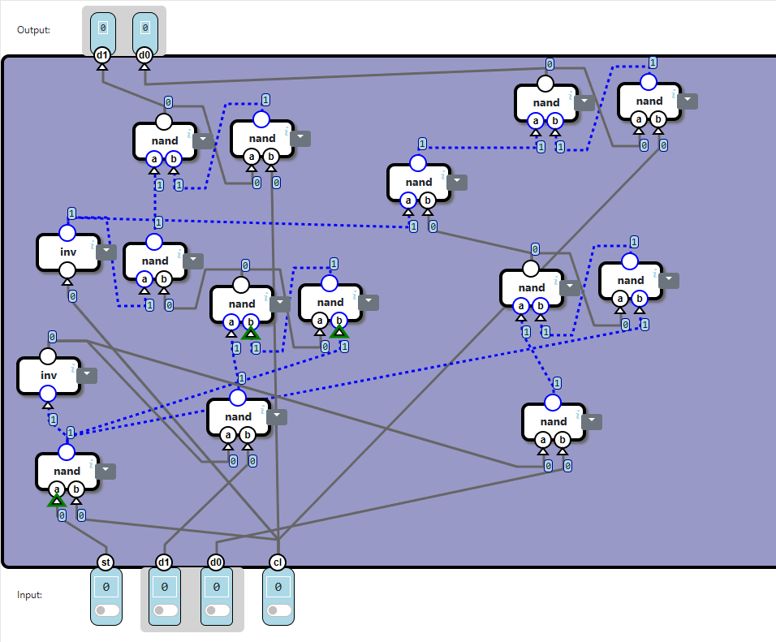

# NandGame_solution-optimal-
nandgame网站所有题目最优解答案，包括文字解释 

## 注意事项

1. 本篇基于 2022 年版的内容，中间网站可能会更新其他章节，或修改相关规则，查阅时注意分辨

2. 部分章节是使用最少组件最优解，但不是最少 nand 最优解

## 与非门

跟据题目对两个继电器的描述得到  
relay(default off) 表达式为A&B 
relay(default on) 表达式为 (~A)&B 
所以 A nand B = \~(A & B) = (\~(A&B)&True) = (A relay(default off) B) relay(default on) 1
## 非门

根据题目得到 
nand表达式为 \~(A&B) 
所以 \~A = \~(A&A) = A nand A 
## 与门

根据题目得到 
nand表达式为 \~(A&B) 
inv 表达式为 \~A 
所以 A&B = \~(\~(A&B)) = inv(A nand B) 
## 或门

根据题目得到 
nand表达式为 \~(A&B) 
inv 表达式为 \~A 
所以 A|B = \~(\~A & ~B) = inv(A) nand inv(B) 
## 异或门

根据题目得到 
nand表达式为 \~(A&B) 
所以 A xor B = \~(\~(A & \~(A & B)) & \~(B & \~(A & B))) 
简化为C=\~(A&B) = A nand B 
A xor B = \~(\~(A & C) & \~(B & C)) = (A nand C) nand (B nand C) 
## 半加器

加法运算中，个位数上加法当两边同时为0时为0，两边同时为1时进位（结果位为0，进位为1），一个1一个0结果位上为1 
故结果位 a xor b 
进位 a and b 
将 a xor b 拆分，其中 xor中组件a nand b可以接上 inv 从而变成 and，节省材料 
## 全加器

全加器为三个一位二进制数进行相加，结果位上为a和b之间相加的结果再和c之间相加的结果，进位为a和b之间相加的结果是否有进位，或a和b之间相加的结果和c相加后有进位 
所以 
结果位为 ((a add b)[l] add c)[l] 
进位为((a add b)[l] add c)[h] or (a add b)[h] 简化为 X = a add b, (X[l] add c)[h] or X[h] 
其中 add 中进位输出的那一位由 inv(a nand b)得来，而a or b可以转化成 inv(a) nand inv(b) 
所以可以将add拆开，将其中inv去掉，a nand b的结果直接作为进位的反进行输出，然后将or改成inv(a) nand inv(b)，这里正好需要进位的反，所以可以避免连续两次取反浪费材料 
## 多位加法器

根据加法的运算法则，当前两位之间进行加法发生进位时，进位的数值作为下一位加法的输入 
所以 
s0 = add(a0, b0, c)[l] 
s1 = add(a1, b1, add(a0, b0, c)[h])[l] 
c_out =  add(a1, b1, add(a0, b0, c))[h] 

## 自增

根据题意得 
自增一即为将此数加上1 
所以 
out = a add16 (inv(0)) 

## 减法

一个数减去另一个数在计算中可以看成是一个数加上另一个数的负数形式，而一个数的负数在计算机眼里即为将这个数按位取反加一 
所以 
out = a add16 (inc(inv(b))) 

## 判断为 0

由题意得，其中任何一位出现1时结果为0 
所以 
out = \~(b0 | b1 | b2 | b3) = inv((b0 or b1) or (b2 or b3)) 
## 判断小于 0

有符号数的正负判断就是看最高位是否为1 
## 选择器

当s为1时输出d1的值，当s为0时输出d0的值 
所以 
out = (s and d1) or (inv(s) and d0) 
将and 和 or拆分为nand组件得到 
out = (inv(inv(s nand d1))) nand (inv(inv(inv(s) nand d0))) 
将连续的inv 两两去掉得到 
out = (s nand d1) nand (inv(s) nand d0) 
## 开关

当s为1时 输出d到c1，当 s 为 0 时 输出d到c0 
所以 
c1 = s and d 
c0 = inv(s) and d 
同时 
c0 = inv(s) and d = (inv(s) and d) or (inv(d) and d) = (inv(s) or inv(d)) and d = inv(s nand d) and d 
     = inv((s nand d) nand d) 
c1 = inv(s nand d) 
所以可以将s nand d接到两个输入端中 
令 X = s nand d 
c0 = inv(X nand d) 
c1 = inv(X) 
## Logic Unit

op0选择是否为add xor 或者 or invert 
op1选择op0所连接两个选择器的第一个选择器的结果还是第二个选择器的结果 
将op0连接两个选择器，再将op1连接一个选择器并将op0选择的结果再进行选择 

## Arithmetic Unit

op0选择第二个操作数是1还是y 
op1选择所执行的运算规则是加法还是减法 
## ALU

u通过选择器来决定是输出算数单元的结果还是逻辑单元的结果 
通过op0和op1作为运算单元的输入来决定两个运算单元的运算法则 
zx通过选择器来选择第一个操作数时0还是sw所选择出的第一个操作数的值 
sw通过两个选择器来选择第一个操作数是x还是y，第二个操作数是y还是x 

## 条件

对于x判断小于0 lt_out = is_neg(x) and lt 
对于x判断等于0 eq_out = is_zero(x) and eq 
对于 x 判断大于0 即判断x不小于或等于0 gt_out = inv(is_zero(x) or is_neg(x)) and gt 
结果out =  lt_out or eq_out or gt_out 
但是or与and连线之间存在两个连续的inv，转化为nand后消除inv 
## D 锁存器

当s为0时，将d的值作为输出 
当s为1时，将输出的结果作为输出 
## 触发器

对于out的值，由in作为数值输入并且由cl作为存储控制 
对于in的值，由d作为数值输入并且由st作为存储控制，但是题意中说明，当cl为1时st无效，所以应当为st and inv(cl)作为存储控制 
该种方法nand数目为11个 
同时将latch拆分，可以发现inv(cl)也可以作为out锁存器的一个输入替代，两条线连接在一起节省一个inv 
st and inv(cl)中一个and可以拆分成inv(st nand inv(cl))，同时发现此处分离出来的inv正好要在in锁存器中使用，将nand的输出接入到in锁存器内部，节省一个inv 
最后总花费nand数目为9个，达到最优解 

## 寄存器

将触发器的触发端接入到cl端，将触发器的存储控制端连接到st端，d0和d1接入到两个触发器的数值输入端，最后将两个触发器的输出连接到out_d0, out_d1 

触发器中存在部分逻辑重合，可以进行部分复用省略 

## 计数器

无论进行何种操作，寄存器中的in的值都是直接对外开放的，in的值可以在任何时间被改变，所以register的存储控制位总是为1 
而st则选择是将X的值给in还是将out+1的值给in，cl则是负责将out的值转变成in的值 
## RAM

利用开关，ad选择将st的值发送到那个寄存器中，同时使用选择器，来选择输出哪一个寄存器的out值 
## 复合存储器

dst负责控制将X输入到那个存储器中，所以dst中a，d，*a分别连接三个存储器的st位 
X连接三个存储器的数据输入位 
cl负责将存储器中所有数据输出到输出端口，所以cl连接三个存储器的cl位 
ram的地址值是由A寄存器的值得来的，所以将A寄存器的输出端连接到ram的地址输入端 
## Instruction

根据题意 
将指令中6到10位给ALU中对应的运算控制，同时第12位表示选择第二个操作数是A还是*A，第一个操作数是D 
指令中0到2位判断ALU的结果是大于等于或小于0，并将结果给符号位j 
指令中3到5位直接输出到dst中 

## Control Unit

通过is_neg来判断最高位是否为1，如果为1那么选择alu instruction中所有输出作为最终输出，否则按照题意，将地址传入到R输出端口，将dst中a设为1，其他输出默认为0 
## Computer

clock时钟负责控制计数器和内存的运行周期 
计数器负责标识当前应当读取的ROM的指令地址 
ROM将指令传输给控制单元 
控制单元读取指令，并解析执行指令，如计算从内存中读取到的数据并从R端口输出，a，d，\*a输出端表示是否将R的值写入到指定内存块中，j符号位表示是否改写计数器中的值，还是按照规律加一
内存在每个周期中，将a，d，\*a中的值传给控制单元中，输入端a，d，\*a表示是否将X写入到指定内存块中 
